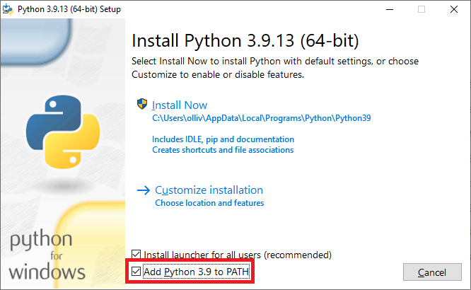
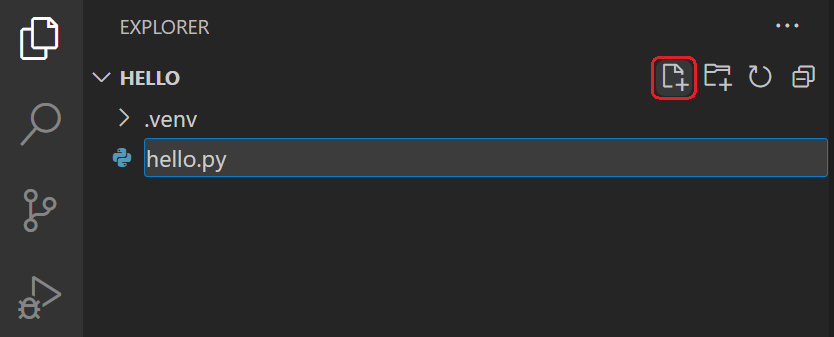
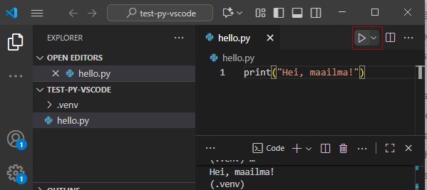

# Ensimmäinen ohjelma

Tervetuloa ohjelmoimaan Python-kieltä Metropolia Ammattikorkeakoulussa!

... ja sama Pythoniksi:

```python
print("Tervetuloa opiskelemaan Python-kieltä!")
```

[Python](https://www.python.org/) on maailman yleisimpiä ohjelmointikieliä. Kun opiskelet Pythonia, voit:

- oppia ohjelmoimaan helposti ja hauskasti
- koodata laadukkailla ja ergonomisilla kehitystyökaluilla
- luoda näyttävää grafiikkaa visualisointikirjastojen avulla
- soveltaa tekoälyä kattavien koneoppimiskirjastojen ansiosta

Ensimmäisenä opiskeluvuonna saat vankat Python-ohjelmoinnin perustaidot. Syvennät osaamistasi myöhemmissä opinnoissa, ja opit käyttämään Python-kieltä työkaluna ohjelmointi- ja ohjelmistotuotantoprojekteissa. 

Tässä ensimmäisessä moduulissa asennat Python-kehitystyökalut ja opit kirjoittamaan ja ajamaan ensimmäisen Python-ohjelmasi.

## Python-ohjelmointiympäristön asennus

Ensimmäisenä tehtävänä onkin asentaa ohjelmointiympäristö, joka koostuu Python-tulkista ja koodieditorista lisäosineen (ohjelmistokehitin). Tällä opintojaksolla käytetään [Visual Studio Code](https://code.visualstudio.com/) -kehitintä. Ohjelmiskehittimestä käytetään myös englanninkielistä nimitystä IDE, joka tulee sanoista *Integrated Development Environment*. Se tarkoittaa ammattikäyttöön soveltuvaa ohjelmistoa, jonka avulla voit kirjoittaa, ajaa ja testata ohjelmia.

Ohjelmointiympäristön asentaminen tapahtuu [näiden ohjeiden](https://code.visualstudio.com/docs/python/python-tutorial) mukaisesti.

### Python-tulkin asennus

Python-tulkki on ohjelma, joka lause kerrallaan tulkkaa Python-kieliset lauseet tietokoneen suorittimen ymmärtämään muotoon eli konekielelle. Sen asentaminen on välttämätöntä, jotta voit ohjelmoida Pythonilla.

1. Siirry selaimella sivulle <https://www.python.org/downloads/>.
1. Lataa viimeisin versio (3.x.x) Pythonista omalle käyttöjärjestelmällesi. (Windows, MacOS) ja käynnistä asennusohjelma.
1. Etene ohjatun toiminnon esittämällä tavalla, ja asenna Python asennusohjelman ehdottamaan oletussijaintiin.
   - Valitse asetus "*Add Python to PATH*" asennusikkunasta, jotta Python löytyy myös komentoriviltä tarvittaessa helposti.

**Tärkeää:** Ohjattu asennustoiminto tarjoaa mahdollisuuden lisätä Python-tulkki Windows-käyttöjärjestelmän `PATH`-ympäristömuuttujaan. Kyseinen ympäristömuuttuja sisältää luettelon kansioista, joista käyttöjärjestelmä etsii suoritettavia ohjelmia automaattisesti. Lisäys kannattaa tehdä: sen ansiosta voit antaa komentoikkunassa komennon `python` (tai `python3`) mistä tahansa kansiosta, ja Python-tulkki löytyy automaattisesti. (Tästä on hyötyä tulevilla Laitteisto 1 ja 2 -opintojaksoilla, joilla myös työskennellään Pythonilla.)

Seuraava kuva näyttää valintaruudun, josta lisäys tehdään:



### Kehittimen asennus

1. Lataa ja asenna [Visual Studio Code](https://code.visualstudio.com/).
1. Asennuksen jälkeen avaa Visual Studio Code ja asenna [Python-laajennus](https://marketplace.visualstudio.com/items?itemName=ms-python.python).

### Ensimmäisen ohjelmointiprojektin ja Python-tiedoston luonti

Nyt olet valmis kirjoittamaan ensimmäisen ohjelman. Ensimmäiseksi on perustettava projekti. Projektia voi ajatella eräänlaisena salkkuna, johon kerätään samaan aihepiiriin liittyviä ohjelmia. Esimerkiksi ensimmäisiä ohjelmointikokeiluja varten voit perustaa uuden projektin nimeltä `python-harjoitukset`. Projekti on käytännössa sitä varten omistettu **kansio** tietokoneen käyttöjärjestelmän tiedostojärjestelmässä, johon kerätään kaikki ohjelmatiedostot ja mahdolliset muut tiedostot, joita ohjelma tarvitsee toimiakseen.

Tee siis projektia varten uusi kansio. Voit luoda kansion esimerkiksi työpöydälle tai omiin asiakirjoihisi. Anna kansion nimeksi `python-harjoitukset`. Avaa luotu kansio Visual Studio Codessa. Voit tehdä sen valitsemalla **File / Open Folder** ja valitsemalla sitten luomasi kansion.

Avaa *Command Palette* painamalla `Ctrl+Shift+P` (Windows) tai `Cmd+Shift+P` (MacOS). Kirjoita avautuvaan kenttään `Python: Create Environment` ja valitse se. Valitse sitten ympäristötyypiksi `Venv` ja paina Enter. Valitse lopuksi Python-tulkin sijainti (tuoreín asentamasi version), jos sitä kysytään.


Uusi projekti perustetaan luoden Python virtuaaliympäristö (venv). Tämä helpottaa omien ohjelmien käyttämien Python-pakettien ja niiden versioiden hallintaa.

Virtaaliympäristö luodaan projektin kansion sisälle kansioon nimeltä `.venv`. Projektikansiosi sisällön näet vasemman laidan tieodostoselaimessa (Explorer).

Jokainen ohjelma kirjoitetaan tiedostoon projektin kansiohierarkian sisälle. Voit tehdä ensimmäistä
ohjelmaa varten uuden tiedoston napsauttamalla projektikansion nimen vieressä olevaa kuvaketta:



Anna tiedoston nimeksi esim. `hello.py` ja paina Enter. Python-ohjelmat kirjoitetaan tiedostoihin, joiden päättenä on `.py`.

## Ohjelman kirjoitus, tallennus ja ajo

Ohjelma, eli Python-lähdekoodi, kirjoitetaan editorikenttään:

```python
print("Hei, maailma!")
```

Tallenna tiedosto painamalla `Ctrl+S` (Windows) tai `Cmd+S` (MacOS). Nyt voit suorittaa eli ajaa ohjelman napsauttamalla editorikentän yläpuolella olevaa nuolikuvaketta:



Tuloste ilmestyy alareunan konsoli-ikkunaan:

```output
Hei, maailma!
```

Jos ohjelmassa on virheitä, ei hätää! Saat virheilmoituksen, joka auttaa virheen paikantamisessa. Sen jälkeen voit korjata ohjelmaa niin monta kertaa kuin on tarpeen ja suorittaa sen aina uudelleen.

Virheiden teko kuuluu ohjelmointiin. On arvioitu, että 80 prosenttia ammattimaisen ohjelmoijan työajasta kuuluu virheiden jäljitykseen ja niiden korjaamiseen. Myös oppiminen tapahtuu virheitä tekemällä. Kun selvität virheen syyn ja korjaat sen, olet oppinut hieman paremmaksi ohjelmoijaksi.
