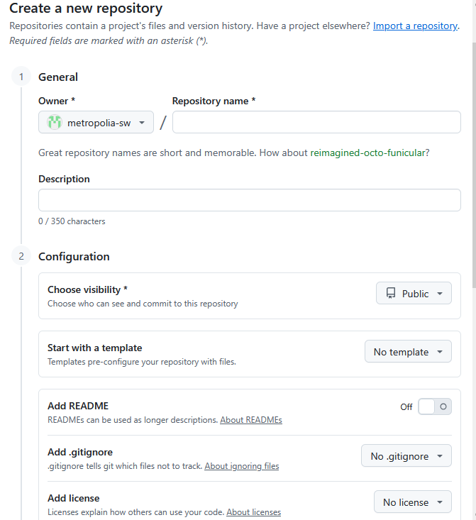
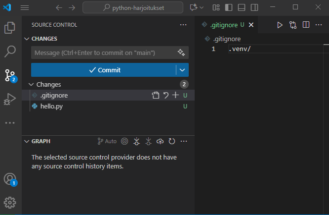

# Versionhallinnan käyttöönotto

Ohjelmistot rakentuvat vaihe vaiheelta ja pala palalta. Ohjelmistoja tehdään usein tiimityönä, ja tiimin jäsenten on päästävä käsiksi samaan ohjelmakoodiin. Ohjelmakoodista syntyy kehitystyön aikana useita versioita, ja joskus on tarve palata aiempaan versioon. On myös tärkeää varmistaa, että kerran kirjoitettu ohjelmakoodi ei vahingossa tuhoudu eikä katoa.

Tätä varten otetaan käyttöön versionhallinta.

## Git ja GitHub

Opintojaksolla (ja ammattimaisessa ohjelmistokehityksessä usein) käytetään Git-nimistä hajautettua versionhallintaa. Hajautettu versionhallinta tarkoittaa sitä, että ohjelmakoodien yhteisestä tallennuspaikasta - eli repositoriosta - luodaan paikallisia kopioita versionhallinnan käyttäjien omille tietokoneille. Ajantasaiset tiedot päivitetään usein yhteisestä jaetusta repositoriosta omalla koneella olevaan paikalliseen repositorioon työskentelyn alkaessa (tästä käytetään termiä *pull*). Koodiin tehdyt muutokset tallennetaan uutena versiona paikalliseen repositorioon ( käytetään termiä *commit*) ja voidaan päivittää takaisin jaettuun repositorioon (tätä kutsutaan termillä *push*).

GitHub on kaikkien saatavilla oleva verkkosivusto, johon Git-projektien ohjelmakoodit (repositorio) voidaan tallentaa ja jakaa. Se on myös maailman suurin tähän tarkoitukseen kehitetty sivusto, ja käytännössä jokainen ohjelmointialan ammattilainen käyttää tavalla tai toisella GitHubia.

Jotta voit käyttää GitHubia, rekisteröidy sen käyttäjäksi osoitteessa <https://github.com/>.

Kun olet luonut itsellesi käyttäjätilin GitHubiin, voit luoda sinne repositorioita eli tallennuspaikkoja projekteille.

## Repositorion luominen GitHubissa

1. Rekisteröidy GitHubin käyttäjäksi osoitteessa <https://github.com/>.
1. Kirjauduttuasi sisään paina **Repositories**-otsikon vieressä olevaa **New**-painiketta.
1. Tee itsellesi oma repositorio alla olevan kuvan mukaisesti ja anna sen nimeksi esimerkiksi `python-harjoitukset`.
1. Paina lopuksi **Create repository** -painiketta.

Tämän jälkeen VS Code-kehittimessä oleva projekti pitää liitetään GitHub-projektiin

## Git ja Visual Studio Code

Ennen kuin voit käyttää Git-versionhallintaa, sinun on asennettava Git-ohjelmisto omalle tietokoneellesi. Lataa ja asenna se osoitteesta <https://git-scm.com/downloads> ohjeiden mukaisesti.

Gitin asennuksen jälkeen voit ottaa sen käyttöön Python-projektissasi:

1. Avaa VS Code ja avaa projekti, jonka haluat liittää Git-versionhallintaan.
1. Avaa terminaali (Terminal) VS Code -editorissa.
1. Määritä käyttäjänimesi komennolla `git config --global user.name "Etunimi Sukunimi"`.
1. Määritä sähköpostiosoitteesi komennolla `git config --global user.email "sahkoposti@esimerkki.com"`. Sähköpostiosoite on sama, jota käytit rekisteröityessäsi GitHubiin.
1. Luo `.gitignore`-tiedosto projektin juureen. Lisää tiedostoon rivi `.venv/`, jotta virtuaaliympäristön tiedostot eivät päädy versionhallintaan.
1. Alusta Git-versionhallinta projektille ja liitä se GitHub-repositorioon valitsemalla vasemman laidan palkista löytyvä Git-kuvake (tai paina näppäinyhdistelmää `Ctrl+Shift+G`), ja paina sitten **Publish to GitHub** -painiketta.

### Vaihtoehtoisesti voit tehdä Git repositorion alustamisen myös "käsin" terminaalissa

1. Alusta uusi Git-repositorio komennolla `git init`.
1. Lisää tiedostot versionhallintaan komennolla `git add .`.
1. Tee ensimmäinen commit komennolla `git commit -m "Initial commit"`.

Tämän jälkeen paikallinen Git-repositorio on valmis, ja voit liittää sen GitHubissa luomaasi repositorioon, tähän on muutamia eri vaihtoehtoja:

- Yksinkertaisin tapa liittää paikallinen Git-repositorio GitHubissa luomaasi repositorioon on käyttää VS Code -editorin sisäänrakennettua Git-tukea.
    1. Avaa Command Palette painamalla `Ctrl+Shift+P`.
    1. Kirjoita kenttään `Publish to GitHub` ja valitse se.
    1. Seuraa ohjeita.
- Voit käyttää kirjautumiseen myös GitHubin omaa laajennusta VS Code -editorissa
    1. Asenna laajennus etsimällä se VS Code -editorin laajennushallinnasta (Extensions) nimellä "GitHub Pull Requests".
    1. Asennuksen jälkeen kirjaudu sisään GitHub-tilillesi laajennuksen kautta painamalla vasemman laidan palkista GitHub-kuvaketta.
- Kirjautumisen jälkeen voit liittää paikallisen Git-repositorion GitHub-repositorioon myös komentoriviltä (terminal) seuraavasti:
    1. Kopioi GitHubissa luomasi repositorion URL-osoite (HTTPS).
    1. Lisää etärepositorio komennolla `git remote add origin <kopioitu-URL>`.
    1. Työnnä paikallisen repositorion sisältö GitHubiin komennolla `git push -u origin main`.
 Kirjaudu VS Code -editorissa sisään GitHubiin  ja valitsemalla **Sign in to GitHub**. Seuraa ohjeita.

## Repositorion käyttö

Tarkastellaan tässä vaiheessa GitHubin käyttöä yhden kehittäjän näkökulmasta. Tällöin voimme olettaa, että eri kehittäjät eivät käytä samoja tiedostoja, ja tästä aiheutuvia samanaikaisen muokkauksen ongelmia ei esiinny. Oletamme myös, että meille ei synny tarvetta jakaa kehitysprojektia eri kehityshaaroihin. GitHubin edistyneeseen käyttöön kehitystiimin yhteistyöalustana kannattaa perehtyä vasta myöhemmin projektityön alkaessa.

Vs Code -editorissa on sisäänrakennettu Git-tuki, jota kannattaa käyttää versionhallinnan perustoimintoihin. Ne löytyvät editorin vasemman laidan palkista Git-kuvakkeen takaa (tai painamalla näppäinyhdistelmää `Ctrl+Shift+G`).

Työskentelyssä kannattaa ottaa tavaksi seuraavat käytännöt:

- Kun aloitat työskentelyn, anna komento **Git / Pull**. Komento hakee mahdolliset muuttuneet tiedot GitHub-palvelussa olevasta repositoriosta.
- Kun olet saanut uusia tuotoksia aikaan, valitse **Git / Add** toiminnolla tiedostot ja muutokset, jotka haluat mukaan seuraavaan tallennuspisteeseen
- Sitouta muutokset komennon **Git / Commit** avulla. Muutosten pohjalta syntyy uusi tallennuspiste, johon on mahdollista myöhemmin palata, jos tarvetta ilmenee. Sitouta muutokset aina viimeistään siinä vaiheessa, kun olet lopettamassa työskentelyä. Commit-viestiin kannattaa kirjoittaa lyhyt kuvaus siitä, mitä muutoksia on tehty.
- Kun lopetat työskentelyn, anna komento **Git / Push**. Komento kopioi paikallisella koneessa olevat sitoutetut muutokset GitHub-palvelussa olevaan repositorioon.

Voit tutkia kehityshaaraa tallennuspisteineen GitHub-palvelussa.

Kaikki lähdekoodit, kuvat ja muut arvokkaat tiedostot on syytä tallentaa GitHubiin. Toisaalta konfiguraatiotiedostot ja muu ajoympäristöön liittyvä silppu kannattaa jättää versionhallinnan ulkopuolelle. Myöskään salasanoja sisältäviä tiedostoja ei tietoturvasyistä tule tallentaa versionhallintaan. Pois jätettävät tiedostot listataan projektiin tallennettavassa `.gitignore`-tiedostossa.

## Tehtävien palautus GitHubin avulla

Palauta Omassa oleviin tehtäviin aina suoraan kyseisen moduulin tehtävien ratkaisuun osoittava linkki. Se onnistuu helpoiten niin, että navigoit selaimella GitHubissa oikeaan kansioon ja kopioit linkin suoraan selaimen osoiteriviltä. Nimeä python-tiedostosi ja kansiosi niin, että niistä voi päätellä suoraan, minkä tehtävien ratkaisut ne sisältävät.

**Jos repositoriosi on yksityinen:** Jotta opettajat näkevät tiedostosi GitHubissa, sinun pitää lisätä opettajien käyttäjätunnukset GitHub-projektiisi käyttäjiksi. Tämä tapahtuu *Settings*-välilehdeltä kohdasta *Collaborators*. Opettajien tunnukset kerrotaan Oma-työtilan kautta. Vaihtoehtoisesti voit muuttaa projektisi näkyvyyden julkiseksi (public) projektin asetuksista.

---

[Seuraavassa moduulissa aloitetaan varsinainen ohjelmointi.](02_Muuttujat_ja_vuorovaikutteiset_ohjelmat.md)

---
